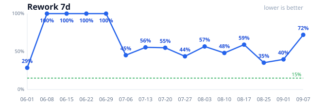
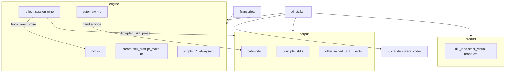
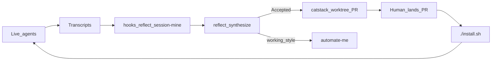

<div align="center">

# catstack

**Self-improving ecosystem engine** (engine + corpus + product) for Claude, Cursor, and Codex

[](https://github.com/EdbertChan/catstack/actions/workflows/ci.yml)
[](#install)
[](#skills)
[](#hooks)

One clone. One `./install.sh`. Same stack on every machine.

**[Install](#install)** · **[Ecosystem](docs/ecosystem.md)** · **[Skills](#skills)** · **[Hooks](#hooks)** · **[Provenance](docs/provenance.md)**


### Agent DORA (personal)

Rework should go **down** over time. Full charts + snapshot:
[engine/skills/reflect/baselines/dora-ai-report.md](engine/skills/reflect/baselines/dora-ai-report.md)



</div>

## Ecosystem

One clone. Three buckets. Mine → apply → PR → install. Details: [docs/ecosystem.md](docs/ecosystem.md).



### Engine loop

What drives improvement: thrash/stop hooks, `/reflect`, or opt-in session-mine mine transcripts; Accepted opens a worktree + PR (never merge); you land it; `./install.sh` refreshes live agents.



Bucket inventory and ownership rules: [docs/ecosystem.md](docs/ecosystem.md).

## What you get

<table>
<tr>
<td width="50%" valign="top">

### One install

`./install.sh` symlinks skills, hooks, slash commands, and always-on rules into Claude, Cursor, and Codex. Safe to rerun. Edit here, `git pull` on another machine, every symlink updates.

</td>
<td width="50%" valign="top">

### Always-on rules

Short answers (`diu`), evidence before "it works" claims (`CLAUDE.md`), and PR drafting that actually uses the skill (`draft-pr`) — not a generic `gh pr create` recipe.

</td>
</tr>
<tr>
<td width="50%" valign="top">

### Hooks that catch drift

Stop-time brevity checks, bug-complaint search discipline, thrash-triggered `reflect`, live-demo freeze, restart-risk checks. Fail-open. Per-agent, because each harness has different stop-time power.

</td>
<td width="50%" valign="top">

### Portable, not project-locked

Skills generalized from Invoker, DrafterSkill, and pstack. Invoker-only helpers stay in [Invoker](https://github.com/Neko-Catpital-Labs/Invoker). Where each file came from: [provenance](docs/provenance.md).

</td>
</tr>
</table>

## Install

```bash
git clone https://github.com/EdbertChan/catstack.git
cd catstack
./install.sh
```

Already have local copies? `./install.sh --force` backs them up, then links.

### Engine-only mode

`./install.sh --engine-only` links only the engine: `reflect`, `automate-me`, `create-skill`, `draft-pr`, `make-pr`, `thrash-reflect-automate`, every engine hook, the always-on rules, plus the four gates the engine cites (`diu`, `visual-proof`, `split-scope`, `narrow-the-scope`). It prunes every other corpus and product symlink from the three harness skill folders and points `~/.claude/CLAUDE.md` at `engine/CLAUDE.core.md`, so the mined rules in `corpus/CLAUDE.learned.md` are not loaded. A plain `./install.sh` restores everything.

Corpus stays in git and keeps refilling as `reflect` and `automate-me` run, so a newer model can regenerate the principles from scratch while you keep working.

Claude-only skills (`automate-me`, `cat-mode`, `narrow-the-scope`) skip Cursor and Codex on purpose.

## Skills

Each skill is a `SKILL.md` package under `engine/skills/`, `corpus/skills/`, or `product/skills/` (install flattens to `~/.*/skills/<name>`).

| Skill | What it does |
| --- | --- |
| `diu` | Short answers by default. Lead with the outcome. |
| `draft-pr` | Draft or update a PR with a real schema, not a generic template. |
| `create-skill` | Author/install skills for Claude, Cursor, and Codex — never one harness. |
| `split-scope` | Shape diffs so each PR is one reviewable unit. |
| `land-stack` | Land a stacked PR by SHA, never by branch name. |
| `reflect` | Mine a transcript for durable learnings. Accepted items open a catstack worktree + PR (never merge); working-style routes to `automate-me`. |
| `automate-me` | Turn working-style findings into a personal `<handle>-mode` skill. Claude-only. |
| `visual-proof` | Real before/after captures. No stale screenshots. |
| `loop-generator` | Interview, then write a babysit/watch/retry loop with real safety rules. |
| `show-me-your-work` | Leftover decision trail so unattended work is reviewable. |
| `narrow-the-scope` | Stop mid-session when retries aren't making progress. Claude-only. |
| `cat-mode` | Edbert's personal conventions. Claude-only. |
| `principle-*` | Narrow engineering rules, cherry-picked from pstack after backtesting against real sessions. |

Full sourcing notes, including what was left out and why: [docs/provenance.md](docs/provenance.md).

## Hooks

| Hook | When it fires |
| --- | --- |
| `diu-stop` | End of turn: did the answer skip the brevity rule? |
| `bug-complaint-leak` | Bug-complaint prompts: search class, not just local grep. |
| `reflect-on-thrash` | Thrash detected: defer reflect until the session ends. Do not steal the current turn. |
| `restart-risk-check` | Thin-evidence "just restart it" claims. |
| `demo-freeze` | Live demo window: don't edit the thing being filmed. |
| `frustration-watchdog` | User-frustration signals. |
| `auto-pr` | catstack itself changed: tell the agent to open a PR, no request needed. |
| `plan-discipline` | **Not installed yet** (needs Agent mode): block product `.py` writes after a declined SwitchMode; require "How we test" on new-module plans; no eval numbers without a verifying run; warn on semantic plan-churn. Spec: `engine/hooks/plan-discipline/README.md`. |

Details live in each hook's README under `engine/hooks/<name>/`.

### Session mine (opt-in)

Hourly local scan of Claude / Cursor / Codex transcripts for repeated user pokes, plus DORA-for-agents metrics. Off by default:

```bash
./install.sh --with-session-mine
```

Details: [`engine/skills/reflect/references/session-mine.md`](engine/skills/reflect/references/session-mine.md).

## Docs

- [Provenance](docs/provenance.md) — where each skill came from, and how to refresh it
- [Contributing](CONTRIBUTING.md)
- [`CLAUDE.md`](CLAUDE.md) — personal, cross-project agent instructions
- [`install.sh`](install.sh) — the one command
