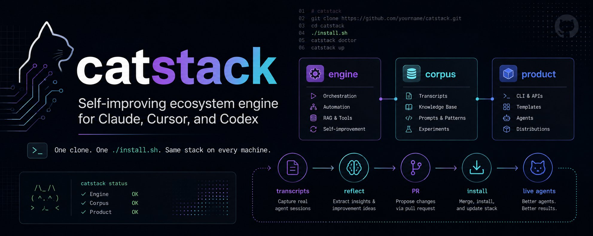
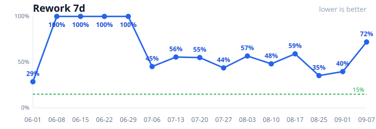
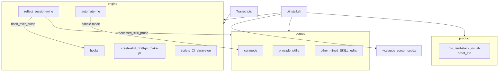
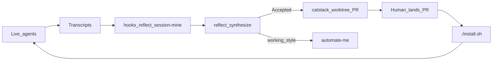

<div align="center">

# catstack

**Self-improving ecosystem engine** (engine + corpus + product) for Claude, Cursor, and Codex

[](https://github.com/EdbertChan/catstack/actions/workflows/ci.yml)
[](#install)
[](#skills)
[](#hooks)

One clone. One `./install.sh`. Same stack on every machine.

**[Install](#install)** · **[Ecosystem](docs/ecosystem.md)** · **[Skills](#skills)** · **[Hooks](#hooks)** · **[Provenance](docs/provenance.md)**



### Agent DORA (personal)

Rework should go **down** over time. Full charts + snapshot:
[engine/skills/reflect/baselines/dora-ai-report.md](engine/skills/reflect/baselines/dora-ai-report.md)



</div>

## Ecosystem

One clone. Three buckets. Mine → apply → PR → install. Details: [docs/ecosystem.md](docs/ecosystem.md).


```mermaid
flowchart TB
  transcripts[Transcripts] --> engine
  subgraph engine [engine]
    hooks[hooks]
    reflect[reflect_session-mine]
    author[create-skill_draft-pr_make-pr]
    automate[automate-me]
    gates[scripts_CI_always-on]
  end
  subgraph corpus [corpus]
    principles[principle_skills]
    personal[cat-mode]
    mined[other_mined_SKILL_edits]
  end
  subgraph product [product]
    portable[diu_land-stack_visual-proof_etc]
  end
  reflect -->|Accepted_skill_prose| corpus
  reflect -->|hook_over_prose| hooks
  automate -->|handle-mode| personal
  install["./install.sh"] --> engine
  install --> corpus
  install --> product
  install --> home["~/.claude_cursor_codex"]
```

### Engine loop

What drives improvement: thrash/stop hooks, `/reflect`, or opt-in session-mine mine transcripts; Accepted opens a worktree + PR (never merge); you land it; `./install.sh` refreshes live agents.


```mermaid
flowchart LR
  agents[Live_agents] --> transcripts[Transcripts]
  transcripts --> triggers[hooks_reflect_session-mine]
  triggers --> mine[reflect_synthesize]
  mine -->|Accepted| worktree[catstack_worktree_PR]
  mine -->|working_style| automate[automate-me]
  worktree --> human[Human_lands_PR]
  human --> install["./install.sh"]
  install --> agents
```

Bucket inventory and ownership rules: [docs/ecosystem.md](docs/ecosystem.md).

## What you get

<table>
<tr>
<td width="50%" valign="top">

### One install

`./install.sh` symlinks skills, hooks, slash commands, and always-on rules into Claude, Cursor, and Codex. Safe to rerun. Edit here, `git pull` on another machine, every symlink updates. At the end of each run it removes any link into catstack that the run did not create, so renamed or deleted hooks and skills do not linger.

</td>
<td width="50%" valign="top">

### Always-on rules

Short answers (`diu`), evidence before "it works" claims (`CLAUDE.md`), and PR drafting that actually uses the skill (`draft-pr`) — not a generic `gh pr create` recipe.

</td>
</tr>
<tr>
<td width="50%" valign="top">

### Hooks that catch drift

Stop-time brevity checks, bug-complaint search discipline, thrash-triggered `reflect`, live-demo freeze, restart-risk checks. Fail-open. Per-agent, because each harness has different stop-time power.

</td>
<td width="50%" valign="top">

### Portable, not project-locked

Skills generalized from Invoker, DrafterSkill, and pstack. Invoker-only helpers stay in [Invoker](https://github.com/Neko-Catpital-Labs/Invoker). Where each file came from: [provenance](docs/provenance.md).

</td>
</tr>
</table>

## Install

```bash
git clone https://github.com/EdbertChan/catstack.git
cd catstack
./install.sh
```

Already have local copies? `./install.sh --force` backs them up, then links.

### Engine-only mode

`./install.sh --engine-only` links only the engine: `reflect`, `automate-me`, `create-skill`, `draft-pr`, `make-pr`, `thrash-reflect-automate`, every engine hook, the always-on rules, plus the four gates the engine cites (`diu`, `visual-proof`, `split-scope`, `narrow-the-scope`). It prunes every other corpus and product symlink from the three harness skill folders and points `~/.claude/CLAUDE.md` at `engine/CLAUDE.core.md`, so the mined rules in `corpus/CLAUDE.learned.md` are not loaded. A plain `./install.sh` restores everything.

Corpus stays in git and keeps refilling as `reflect` and `automate-me` run, so a newer model can regenerate the principles from scratch while you keep working.

Claude-only skills (`automate-me`, `cat-mode`, `narrow-the-scope`) skip Cursor and Codex on purpose.

## Skills

Each skill is a `SKILL.md` package under `engine/skills/`, `corpus/skills/`, or `product/skills/` (install flattens to `~/.*/skills/<name>`).

### Engine skills (7)

Core infrastructure skills for the self-improving loop:

**Mining & automation:**

| Skill | What it does |
| --- | --- |
| `reflect` | Mine a transcript for durable learnings. Accepted items open a catstack worktree + PR (never merge); working-style routes to `automate-me`. |
| `automate-me` | Turn working-style findings into a personal `<handle>-mode` skill. Claude-only. |
| `thrash-reflect-automate` | On FAIL → reflect → fix the class → codify invariant → automate a catch → re-validate. |

**Authoring & publication:**

| Skill | What it does |
| --- | --- |
| `create-skill` | Author/install skills for Claude, Cursor, and Codex — never one harness. |
| `draft-pr` | Draft or update a PR with a real schema, not a generic template. |
| `make-pr` | catstack PR overlay + gates for publication. |

**Judgment infrastructure:**

| Skill | What it does |
| --- | --- |
| `phrase-judge` | Judge whether text matches phrase dictionaries (used by model-judged hooks). |

### Corpus skills (32)

Mined lessons and personal mode skills (engine outputs):

**Personal mode:**

| Skill | What it does |
| --- | --- |
| `cat-mode` | Edbert's personal conventions. Claude-only. |

**Engineering principles (29):**

| Skill | What it does |
| --- | --- |
| `principle-*` | Narrow engineering rules — see docs/ecosystem.md for full list. |

**Output & evidence:**

| Skill | What it does |
| --- | --- |
| `prove-it-ship-gate` | Auto-trigger when claiming done/shipped with live side effects. |
| `report-rendering` | Ship reports as self-contained HTML, not split markdown. |

### Product skills (18)

Portable, human-authored workflows:

**Communication & brevity:**

| Skill | What it does |
| --- | --- |
| `diu` | Short answers by default. Lead with the outcome. |

**Planning & investigation:**

| Skill | What it does |
| --- | --- |
| `plan-first` | Plan-first approach for multi-slice work. |
| `alternatives-considered` | Generate real option sets before committing to design. |
| `spike-and-validate` | Turn untested assumptions into real output with throwaway code. |
| `how` | Trace how a subsystem actually works before changing it. |
| `why` | Recover why code is shaped the way it is before changing it. |

**PR & workflow management:**

| Skill | What it does |
| --- | --- |
| `land-stack` | Land a stacked PR by SHA, never by branch name. |
| `split-scope` | Shape diffs so each PR is one reviewable unit. |
| `admin-bypass-sweep` | Force-merge admin-bypass PRs (MANUAL, HUMAN-ONLY). |

**Evidence & verification:**

| Skill | What it does |
| --- | --- |
| `visual-proof` | Real before/after captures. No stale screenshots. |
| `narrow-the-scope` | Stop mid-session when retries aren't making progress. Claude-only. |
| `show-me-your-work` | Leftover TSV decision trail so unattended work is reviewable. |
| `skill-ab-token-gate` | Paired A/B token proof for skill/hook changes. |
| `independent-judge-swarm` | Mechanical precheck + independent judges for grading. |

**Loops & automation:**

| Skill | What it does |
| --- | --- |
| `loop-generator` | Interview, then write a babysit/watch/retry loop with real safety rules. |
| `event-wait` | Blocking event waits instead of status polling. |

**Infrastructure:**

| Skill | What it does |
| --- | --- |
| `ship-a-detector` | Author a hook/gate detector end to end. |
| `i-have-adhd` | Imported subtree (structure rules now mostly in `diu`). |

Full sourcing notes, including what was left out and why: [docs/provenance.md](docs/provenance.md).

## Hooks

Catstack includes 53 hooks covering evidence rules, session hygiene, routing guards, and quality checks. For the complete inventory with detailed descriptions, see [docs/ecosystem.md](docs/ecosystem.md).

### Evidence & safety (7)

| Hook | When it fires |
| --- | --- |
| `diu-stop` | End of turn: did the answer skip the brevity rule? |
| `hedge-runs-prove-it` | "I think" / "probably" / "should work" / a retired bare `UNVERIFIED:` about code with nothing run this turn: verify now, or tag the claim and name the blocker. |
| `named-verb-guard` | User said test/repro/run/show/delete/revert/stop, or asked for proof twice, and the reply has no evidence: the model judges the request and flags it on a later turn. |
| `wait-needs-wakeup` | Waiting on CI, a queue, a subagent, or a job: schedule a wakeup and name a clock-time ETA. Blocks foreground poll loops and ETA-less "will report" replies. |
| `restart-risk-check` | Thin-evidence "just restart it" claims. |
| `new-file-callout` | A new untracked file at the repo root or under `scripts/`: the reply must name it and say why. |
| `handoff-needs-smoke-test` | A reply hands the user a script (`! bash <path>`) this session never ran: run it, or name why the run cannot happen here. |

### Session hygiene (6)

| Hook | When it fires |
| --- | --- |
| `demo-freeze` | Live demo window: don't edit the thing being filmed. |
| `frustration-watchdog` | User-frustration signals. |
| `restated-constraint` | User repeats a must/never/don't they already gave: apply it, don't re-acknowledge it. |
| `agent-relay-attribution` | Advisory: facts relayed from a subagent's report must say so or be re-verified. |
| `ui-input-guard` | Synthetic keystrokes, clicks, or screen recording aimed at the user's own session: blocked unless a hands-off window is open, the screen is unlocked, and the user is idle. |
| `answer-overrides-menu` | User overrode an AskUserQuestion menu: inject reminder that free text supersedes options. |

### Routing & delegation (5)

| Hook | When it fires |
| --- | --- |
| `fanout-routing-guard` | Block second+ subagent launch when multiple may publish and no routing ran. |
| `serial-option-guard` | Block AskUserQuestion menu with serial "one at a time" recommended option unless routing ran. |
| `categorical-scope-guard` | Block commands that narrow categorical scope (all/every/each) through status filters. |
| `publish-act-guard` | Refuse second subagent publishing within 30min while Invoker owner reachable. |
| `playbook-router` | Inject playbook steps when prompt names a procedure (file-based discovery). |

### Git & PR operations (5)

| Hook | When it fires |
| --- | --- |
| `gh-write-verification` | Five detectors: refuse gh pr edit, block silenced mutations, block pipe exit code issues, block self-matching pgrep, require merge verification. |
| `history-before-reversal` | Block git revert until the change was read and history search ran. |
| `external-claim-gate` | Block gh issue/comment/release API writes whose body claims cause/fix without evidence. |
| `pr-schema-gate` | Advisory: check PR text against repo's validator when writing directly. |
| `bound-tool-result` | Bound shell tool results to 16KiB in parent-visible stdout/stderr (full bytes on disk). |

### Code quality (5)

| Hook | When it fires |
| --- | --- |
| `text-match-decision-warn` | Advisory: warn when new code decides by matching error/log text, tool output, or plan prose. |
| `no-comments` | Block edits that add comment lines to code files (exceptions: shebangs, encoding, machine directives). |
| `explicit-failures` | Advisory: check for empty exception handlers and silent failure paths. |
| `split-scope` | Inject split-scope reminder when prompt plans multi-slice or multi-PR work. |
| `narrow-the-scope` | Inject narrow-the-scope reminder when file reaches 3 edits without verification reset. |

### Infrastructure & opt-in (11)

| Hook | When it fires |
| --- | --- |
| `bug-complaint-leak` | Bug-complaint prompts: search class, not just local grep. |
| `reflect-on-thrash` | Off unless `CATSTACK_REFLECT_ENFORCEMENT=1`: thrash detected → prompt for reflect at session end. |
| `scope-lock` | Off unless `CATSTACK_REFLECT_ENFORCEMENT=1`: stop every tool after second scope correction. |
| `wrong-check-reflect` | Off unless `CATSTACK_REFLECT_ENFORCEMENT=1`: queue judge on retraction-shaped reply. |
| `verdict-flip-watch` | Off unless `CATSTACK_REFLECT_ENFORCEMENT=1`: note verifier that passed then failed. |
| `user-did-it` | Off unless `CATSTACK_REFLECT_ENFORCEMENT=1`: judge whether the user did by hand a step the agent could have done. |
| `handback-needs-attempt` | Off unless `CATSTACK_REFLECT_ENFORCEMENT=1`: judge whether reply hands off commands the agent could attempt. |
| `hook-freshness` | Advisory: warn when catstack checkout behind hooks is off main. |
| `hook-health` | Advisory: report hook runtime health metrics. |
| `skill-usage-log` | Metrics: record every skill use in Claude, Cursor, and Codex. |
| `llm-judge` | Shared background model judge for phrase-dictionary hooks. |

### Unverified tag tracking (2)

| Hook | When it fires |
| --- | --- |
| `unverified-tag-ledger` | Track unverified claims across turns; refuse turn that tags without attempting verification. |
| `unverified-tag-check` | Background check of each unverified tag; report result on next turn. |

### Additional specialized hooks (12)

| Hook | When it fires |
| --- | --- |
| `build-the-lever` | Inject principle-build-the-lever reminder on bulk edits. |
| `claimed-search-not-run` | Stop hook: reply cites history search as having run, but no matching Bash call in session. |
| `gate-blame-needs-evidence` | Judge whether reply blames a gate without reading its source or citing the rule. |
| `incidence-needs-repetition` | Judge whether reply claims behavior across runs while showing evidence from one run. |
| `scratchpad-collision` | Two agents writing the same scratchpad file within ten minutes: use a uniquely named file. |
| `auto-pr` | catstack itself changed: tell the agent to open a PR, no request needed. |
| `cat-mode-default` | Apply cat-mode on every prompt and subagent prompt when `CATSTACK_CAT_MODE_DEFAULT=on`. |
| `plan-discipline` | **Not installed yet** (needs Agent mode): block product `.py` writes after declined SwitchMode. |
| `prove-it-ship-gate` | Block done/shipped claims about live surfaces without same-turn evidence. |
| `repeat-error-stop` | Block blind re-run loops: same command, same error, three times with no change. |
| `repeat-deny-stop` | The same tool deny twice in a row: stop calling tools and do what the deny text says. Never blocks. |
| `agent-launch-guard` | Claude-only warning when subagent launches exceed `CATSTACK_AGENT_LAUNCH_BUDGET` in a time window. Silent when unset. |

Details live in each hook's README under `engine/hooks/<name>/`.

### Reflect enforcement (opt-in)

Four hooks and one always-on rule push you toward `/reflect` and
`automate-me`. All of them are off unless `CATSTACK_REFLECT_ENFORCEMENT` is on:

| What | Read when | What it does when on |
| --- | --- | --- |
| `scope-lock` hook | every tool call | after a second scope correction, stops every tool until you type `/reflect` and `automate-me` |
| `reflect-on-thrash` hook | end of session | asks for a reflect at the end of a thrashy session |
| `wrong-check-reflect` hook | end of turn | queues a judge on a retraction-shaped reply |
| `verdict-flip-watch` hook | after a check runs | notes a verifier that passed and then failed |
| "same complaint type twice: invoke `automate-me`" rule | `./install.sh` | installs the rule for Claude, Cursor and Codex |

```sh
echo 'CATSTACK_REFLECT_ENFORCEMENT=1' >> ~/.catstack.env
./install.sh
```

The hooks see a change on their next run. The rule changes only when
`./install.sh` runs again, and a run with the flag off removes the rule an
earlier run installed. The environment, `$CATSTACK_ENV_FILE`, the repo's `.env`
and `~/.catstack.env` are read in that order. `frustration-watchdog` is not in
this class -- it enforces the live-demo "end the wait" rule and never mentions
reflect. Details: [engine/hooks/_flags/README.md](engine/hooks/_flags/README.md).

### Flags

Every flag is off unless set. "Env and files" is the lookup above; "env only"
is the process environment alone.

| Flag | Read from | Effect |
| --- | --- | --- |
| `CATSTACK_REFLECT_ENFORCEMENT=1` | env and files | the reflect hooks and rule above |
| `CATSTACK_CAT_MODE_DEFAULT=off\|decide\|on` | env and files | `off`: `cat-mode` runs only when typed as `/cat-mode`. `decide`: `./install.sh` installs `cat-mode` so the model may pick it on its own (re-run install after changing to or from it). `on`: `cat-mode-default` applies `cat-mode` to every prompt and every subagent prompt. `1` means `on`, `0` means `off`. |
| `CATSTACK_HOOK_FRESHNESS=off\|local\|fetch` | env only | `hook-freshness` mode: `off` (or `0`) silences it; `local`, the default, counts against the last-fetched `origin/main`; `fetch` runs a short `git fetch` first |
| `CATSTACK_SKILL_USAGE_LOG=0` | env only | turns off `skill-usage-log`, which otherwise records every skill use in Claude, Cursor and Codex (`report.py --skills`) |
| `CATSTACK_LLM_JUDGE_RUNNERS` | env only | a JSON list of `[name, argv]` pairs that replaces the background judge's model runners |
| `CATSTACK_DORA_GIT_ROOTS`, `CATSTACK_DORA_GH_REPOS`, `CATSTACK_DORA_DEPLOY_GIT_ONLY` | env only | session-mine DORA inputs: colon-separated git roots, comma-separated `owner/name` repos, and `1` to skip GitHub search and take merged PRs from local git only |

Path variables, env only, move where a hook or test keeps state:
`CATSTACK_HOOK_METRICS_DIR`, `CATSTACK_LLM_JUDGE_STATE_DIR`,
`CATSTACK_TAG_LEDGER_DIR`, `CATSTACK_SKILL_USAGE_LOG_STATE_DIR`,
`CATSTACK_HOOKS_REPO`, `CATSTACK_REFLECT_RULE_FILE`, and the other
`CATSTACK_*_STATE_DIR` variables.

### Session mine (opt-in)

Hourly local scan of Claude / Cursor / Codex transcripts for repeated user pokes, plus DORA-for-agents metrics. Off by default:

```bash
./install.sh --with-session-mine
```

Details: [`engine/skills/reflect/references/session-mine.md`](engine/skills/reflect/references/session-mine.md).

## Docs

- [Provenance](docs/provenance.md) — where each skill came from, and how to refresh it
- [Contributing](CONTRIBUTING.md)
- [`CLAUDE.md`](CLAUDE.md) — personal, cross-project agent instructions
- [`install.sh`](install.sh) — the one command
