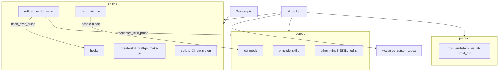

# Catstack ecosystem: engine, corpus, product

Catstack is a **self-improving skill stack**: transcripts feed a mine→apply→PR loop; humans land PRs; `./install.sh` refreshes live agent roots.



## Buckets

| Bucket | Path | Owns |
| --- | --- | --- |
| **engine** | `engine/` | Mine loop, hooks, PR/authoring skills, CI/scripts, always-on rules |
| **corpus** | `corpus/skills/` | Mined lessons and personal mode skills (engine *outputs*) |
| **product** | `product/skills/` | Human-authored portable workflows |
| **external** | outside this repo | Invoker-scoped helpers, other project skills |

Live agents still see flat `~/.claude/skills/<name>` etc. Install flattens the three roots.

## Inventory

### engine (`engine/skills/`, `engine/hooks/`, …)

| Name | Kind |
| --- | --- |
| `reflect` | skill — mine transcripts; session-mine; DORA |
| `automate-me` | skill — produce `<handle>-mode` into corpus |
| `create-skill` | skill — author/install; three-harness |
| `draft-pr` | skill — PR schema |
| `make-pr` | skill — catstack PR overlay + gates |
| `thrash-reflect-automate` | skill — FAIL → reflect → automate |
| `auto-pr` | hook |
| `bug-complaint-leak` | hook |
| `demo-freeze` | hook |
| `diu-stop` | hook |
| `frustration-watchdog` | hook |
| `plan-discipline` | hook (not always installed) |
| `reflect-on-thrash` | hook |
| `restart-risk-check` | hook |
| `engine/CLAUDE.core.md` | global hand-written Claude rules |
| `scripts/`, `always-on/`, `cursor/rules/` (repo root), root `install.sh` | runtime (engine-owned entrypoints at root for CI) |

### corpus (`corpus/skills/`)

Global rules mined by reflect are stored in `corpus/CLAUDE.learned.md`.

| Name | Kind |
| --- | --- |
| `cat-mode` | personal mode (automate-me output) |
| `principle-assert-invariants-not-last-bug` | mined principle |
| `principle-bind-to-named-inventory` | mined principle |
| `principle-build-the-lever` | mined principle |
| `principle-encode-lessons-in-structure` | mined principle |
| `principle-experience-first` | mined principle |
| `principle-fix-root-causes` | mined principle |
| `principle-flag-your-own-corrections` | mined principle |
| `principle-foundational-thinking` | mined principle |
| `principle-generalize-from-rejection` | mined principle |
| `principle-guard-the-context-window` | mined principle |
| `principle-laziness-protocol` | mined principle |
| `principle-manage-idle-resumption` | mined principle |
| `principle-minimize-reader-load` | mined principle |
| `principle-name-the-scorer` | mined principle |
| `principle-never-block-on-the-human` | mined principle |
| `principle-outcome-oriented-execution` | mined principle |
| `principle-scope-the-session` | mined principle |
| `principle-separate-before-serializing-shared-state` | mined principle |
| `principle-sequence-verifiable-units` | mined principle |
| `principle-subtract-before-you-add` | mined principle |
| `principle-type-system-discipline` | mined principle |

### product (`product/skills/`)

| Name | Kind |
| --- | --- |
| `diu` | portable brevity |
| `land-stack` | land stacked PRs |
| `loop-generator` | loop workflows |
| `split-scope` | PR slice shaping |
| `visual-proof` | UI proof |
| `show-me-your-work` | decision log |
| `independent-judge-swarm` | independent judges + mechanical precheck (domain-aware) |
| `narrow-the-scope` | Claude-only scoping |
| `i-have-adhd` | imported subtree (structure rules now mostly in `diu`) |

### Domain sections (inside a product skill)

Some product skills keep a **generic** `SKILL.md` and optional task-type
files under `domains/`:

```text
product/skills/<name>/
  SKILL.md
  domains/
    coding.md
    equities.md
```

The agent reads `SKILL.md`, then **at most one** `domains/<type>.md`
(user words → cwd heuristics → none). Generic prose must not name repo
CLIs; domain files only add triggers and cwd filename lookups. Types
start as `coding` and `equities`. Enforced by
`scripts/check_ecosystem_boundaries.py`. See
`engine/skills/create-skill/SKILL.md`.

### external

| Name | Where |
| --- | --- |
| `invoker-*` | Invoker checkout / home skills |
| `wipe-bad-pr` | project skill (three-harness home link) |

## Contracts

1. Reflect Accepted **skill prose** applies in whichever repo already owns the named skill. Catstack-owned skills (engine/corpus/product) and personal mode (`automate-me` output) write only under `corpus/skills/` — that never changes. A skill owned by another checkout applies there instead, in a worktree of that owning checkout.
2. Reflect may add **hooks** under `engine/hooks/` when the fix hierarchy prefers hook/test over prose (catstack-only; hooks are not skill prose).
3. `automate-me` writes `corpus/skills/<handle>-mode/`.
4. `create-skill`: new portable tools → `product/skills/`; mined lessons → `corpus/skills/`.
5. Engine runtime must not import corpus/product packages (hooks → reflect scripts only, engine-internal).
6. `[auto]` / make-pr review unit follows path: `engine-*` | `corpus-lesson` | `product-skill` | external-owning-repo.
7. Never auto-merge; human land + `./install.sh` refresh. External apply is never-merge in the owning checkout only — same gate, different repo. `engine/skills/reflect` itself is never copied into another repo.

## Enforcement

Bazel is **not** used. Boundaries are enforced by directory layout plus CI:

- [`scripts/check_ecosystem_boundaries.py`](../scripts/check_ecosystem_boundaries.py) — allowlists, no flat `skills/`, no engine→corpus/product imports, domain selector / CLI ownership.
- [`scripts/check_skill_file_refs.py`](../scripts/check_skill_file_refs.py) — skill markdown must not name repo/skill paths that do not exist (consumer contract paths allowlisted).

See those scripts for the mechanical rules.
