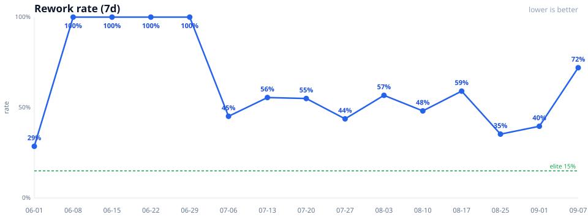
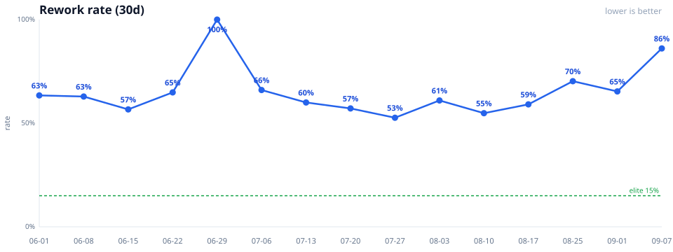
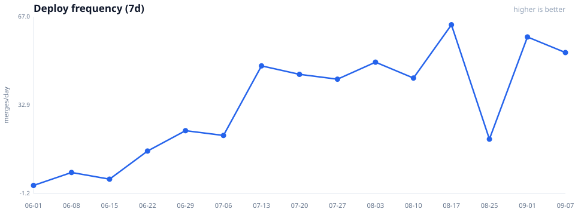
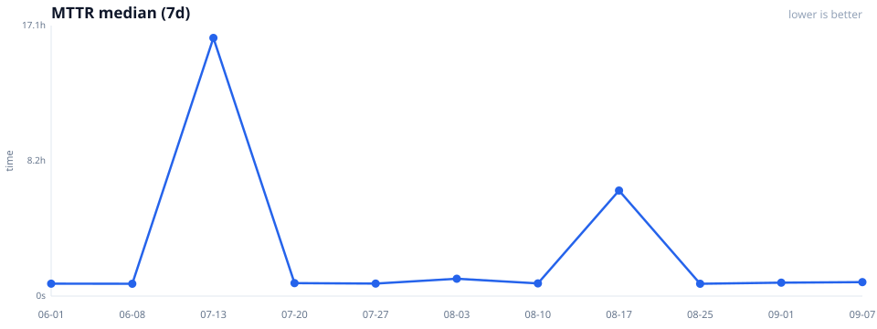

# DORA-for-agents baseline report (v2)

**Captured:** 2026-09-07T17:10:56Z  
**File:** [`dora-ai.json`](./dora-ai.json) · **History:** [`dora-ai-history.json`](./dora-ai-history.json)  
**Goal:** week over week / month over month, bad clocks go **down**; deploy frequency goes **up**. Do not commit a worse baseline.

## Trends

Rework should fall over time (green dashed line = elite 15%).









## What these numbers mean (plain English)

| Clock | Question it answers | Better when |
| --- | --- | --- |
| **Lead** | After you say “go,” how fast does the agent start editing? | Lower |
| **Deploy frequency** | How many PRs merge per day? | Higher (also rises when you work more) |
| **MTTR** | After thrash, how long until a verify-ish recovery? | Lower |
| **Rework** | Of work we started, how often did we thrash or rewrite? | Lower |
| **Post-merge fail** | Reverts / hotfixes after merge | *Reported only* — we fix forward, so this stays ~0 and is **not gated** |

**Elite bars (targets, not the baseline itself):** lead &lt; 15m, deploy ≥ 2/day, MTTR &lt; 1h, rework &lt; 15%.

**Sessions counted:** only human-driven transcripts. Claude Code subagent (sidechain) transcripts under `<session>/subagents/` are excluded and reported separately as `subagent_sessions_skipped`, because their first record is the parent agent's instruction, not a human “go.”

### Where deploy frequency comes from

Count of **shipped changes** in the window ÷ days:

1. **Local git** first-parent commits on `main` for allowlisted clones (Invoker +
   catstack) — works offline and for backfill (no API rate limit)
2. Optional supplement: date-scoped `gh search` on the same repos

So Invoker merges show up. Older chart zeros were from rate-limited GitHub
search + “newest 100 only” listing — fixed.

## Committed snapshot

### Last 7 days

| Metric | Value | Notes |
| --- | --- | --- |
| Lead (median) | **28s** | Sample count: 8. Often synthetic when transcripts lack wall clocks. |
| Deploy | **~53.14 / day** (372 merges) | Uncapped local git first-parent on allowlisted clones (Invoker + catstack); optional gh search with 1000-hit bisect. |
| MTTR (median) | **6.7m** | Sample count: 22. Time from thrash → verify. |
| Rework | **72.0%** (67 / 93) | **Main number to drive down.** Elite &lt; 15%. |
| Post-merge fail | **0.3%** | Reported only — fix-forward; not gated. |
| Subagent transcripts skipped | **169** (18 parent sessions) | Sidechain files are not human sessions; excluded from every clock above. |


### Last 30 days

| Metric | Value | Notes |
| --- | --- | --- |
| Lead (median) | **28s** | Sample count: 8. Often synthetic when transcripts lack wall clocks. |
| Deploy | **~49.23 / day** (1477 merges) | Uncapped local git first-parent on allowlisted clones (Invoker + catstack); optional gh search with 1000-hit bisect. |
| MTTR (median) | **40.3m** | Sample count: 35. Time from thrash → verify. |
| Rework | **86.1%** (161 / 187) | **Main number to drive down.** Elite &lt; 15%. |
| Post-merge fail | **0.1%** | Reported only — fix-forward; not gated. |
| Subagent transcripts skipped | **766** (118 parent sessions) | Sidechain files are not human sessions; excluded from every clock above. |


## How rework is counted (v2)

A started execution “fails” (counts in the numerator) if **either**:

1. **Session thrash** — same flags as `reflect-on-thrash` (including `intervention-must-automate`), or
2. **Git path-churn** — ≥3 commits within 24h that overlap the same path(s), optionally paired to a session via Write/Edit paths + workspace/cwd / `CATSTACK_DORA_GIT_ROOTS`.

```text
rework_rate = failed_executions / started_executions
```

## Refresh (weekly job)

```bash
python3 skills/reflect/scripts/publish_dora_snapshot.py --dry-run
# opt-in schedule: ./install.sh --with-dora-snapshot
```

History always records the measurement. `dora-ai.json` updates only when every gated metric is equal or better (`check_dora_baseline.py --check-update`).
